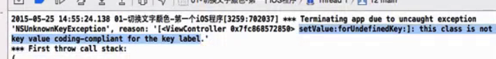

# UI基础
##storyBoard文件的认识
- 用来描述软件界面
- 默认情况下，程序一启动就会加载main.storyboard
- 加载storyboard时候，会首先创建和指向箭头所指的控制器界面
##IBAction和IBOutlet
- IBAction
  - 本质就是void
  - 能让方法具有连线的功能
 - IBoutlet
   - 能让属性具备连线的功能  

##storyboard连线容易出现的问题
- 被连接的方法代码被删除，但是连线没有删除
  - 可能出现方法找不到的错误
  - unrecgnized selector sent to instance  
如下图

