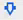
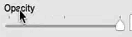
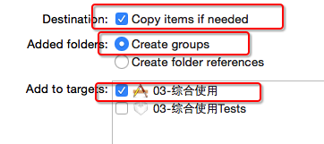

## 九宫格计算思路
- 利用控件的索引index计算出控件所在的行号和列号
- 利用列号计算控件的x值
- 利用行号计算控件的y值  
```
// 每一个商品的尺寸
    CGFloat shopW = 50;
    CGFloat shopH = 70;
    
    // 一行的列数
    int cols = 4;
    
    // 每一列之间的间距
    CGFloat colMargin =
    (self.shopsView.frame.size.width 
    - cols * shopW) / (cols - 1);
    // 每一行之间的间距
    CGFloat rowMargin = 10;
    
    // 创建一个父控件（整体：存放图片和文字）
    UIView *shopView = [[UIView alloc] init];
    shopView.backgroundColor =
    [UIColor redColor];
    
    // 商品的索引 子控件的个数
     NSUInteger index = self.shopsView.subviews.count;
    
    // 商品的x值 索引%列数
    NSUInteger col = index % cols;
    CGFloat shopX = col * (shopW + colMargin);
    
    // 商品的y值  索引/列数
    NSUInteger row = index / cols;
    CGFloat shopY = row * (shopH + rowMargin);
    
    shopView.frame = CGRectMake(shopX, shopY, shopW, shopH);
    [self.shopsView addSubview:shopView];
```  
## HUD
- 其他说法：指示器、遮盖、蒙板
- 半透明HUD的做法
    - 背景色设置为半透明颜色：设置背景色半透明
    - 做法：->

## 定时任务
- 方法1：performSelector

```objc
// 1.5s后自动调用self的hideHUD方法
[self performSelector:@selector(hideHUD) withObject:nil afterDelay:1.5];
```
- 方法2：GCD

```objc
dispatch_after(dispatch_time(DISPATCH_TIME_NOW,  
(int64_t)(1.5 * NSEC_PER_SEC)), dispatch_get_main_queue(),  
^{
    // 1.5s后自动执行这个block里面的代码
    self.hud.alpha = 0.0;
});
```
- 方法3：NSTimer

```objc
// 1.5s后自动调用self的hideHUD方法
[NSTimer scheduledTimerWithTimeInterval:1.5   
target:self   
selector:@selector(hideHUD)   
userInfo:nil 
repeats:NO];
// repeats如果为YES，意味着每隔1.5s都会调用一次self的hidHUD方法
```
##加载plist
- plist文件和资源文件丢在supporting file文件夹内
正确加载方式：
 
 ```objc
 NSBundle *bundle = [NSBundle mainbundle]//主资源包
 ```